<hr>

## Introduction
This is a criticsm of Thành for having a harem. This will explain what indicates that this individual has a harem.
## What happened?

Thành now has a harem. This harem consits of the following individuals assumed to be in the harem:
<details>
<summary>List of assumed members</summary>
<pre>
+ Linh
+ Nghi
+ Vy
</pre>
</details> 

## Indications
These will explain why the theory is partially accurate, the indications will be sort from the most accurate to the least accurate.
### Indication #1
<hr>
On December 3rd 2021, there is a recent of choosing music group, Thành was either chosen, or been chosen to a music group consiting of the above mentioned individuals which are assumed to be in the harem.

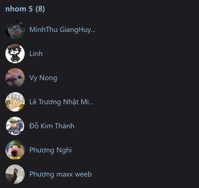

This can be normal as well as they are what so called *best-friends*. But indiviual Hoàng tried to choose that music group, but the individuals in the group which are assumed to be in the harem denied the request. Hoàng explained in the following snippet of chat.

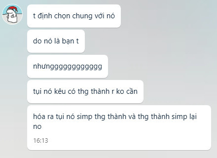

```
Translation:
Message #1: I tried to choose the same group with him
Message #2: Because he is my friend
Message #3: But [Extended the last character of the message]
Message #4: They said they already have Thành so they don't need me.
Message #5: So it turns out that they simps for Thành and Thành simps for them
```
**Conclusion**

This indicates that Thành as his assumed harem members are simping for each other, resulting in a harem.

### Indication #2
<hr>
On December 7th, the time when Christmas is coming near, which means people will start to do Christmas-related things. Thành and his assumed harem members decided to change the profile picture, something related Genshin and Chirstmas.

The changed profile pictures indicating that the group consisting of Thành, however Thành wouldn't have a proper reason to explain why he would change to a girl profile picture, he can give that he likes character in game, explained why he would play Genshin at [this indication](#indication-3), but [Indication #3](#indication-3) explained that he simping for the assu,ed harem member so he would play it. So it can give that Thành is simping for his assumed harem members.

The following image describe the group changed their profile picture on Facebook platform.

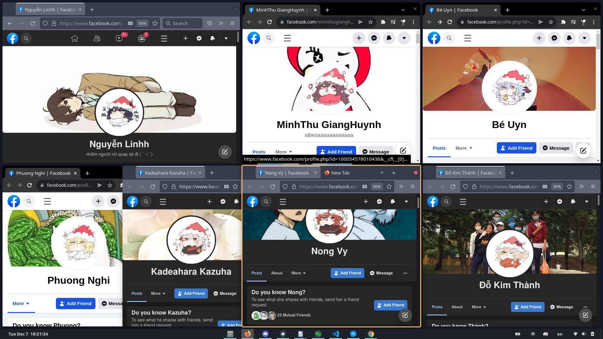

The profile picture of the following people as followed left to right up to down:

*Nguyễn Linh as Linh, MinhThu GiangHuynh (not in assumed harem since only friends with harem members), Bé Uyn (like MinhThu GiangHuynh), Phương Nghi as Nghi, Kadeahara Kazuha(like MinhThu GiangHuynh), Nong Vy as Vy, Đõ Kim Thành as Thành*

Sources of these images are found, in a shared post from assumed harem member named Linh, describe in the following image.

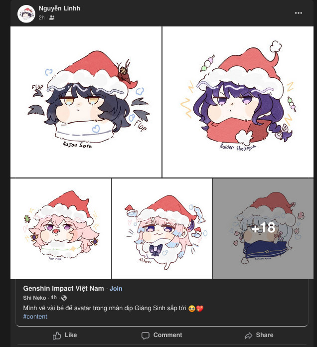

Translation of shared post:
```
Group: Vietnam Genshin Impact
Poster: Shi Neko
Post text: I drew some kids for avatars for the upcoming Christmas #content
```

Thành accepted the offer, even though he is not even female to set this profile picture, only becaus he simps for harem and like in-game characters

### Indication #3
<hr>
During November and December 2021, Thành was convinced to play Genshin Impact by the assumed harem members.

However, this is not the case. The reason that this can be an indicator is that Thành used to describe Genshin as sexualized characters in-game. In the following image, Thành described how Genshin is sexualized and agreed with another person on the same topic.

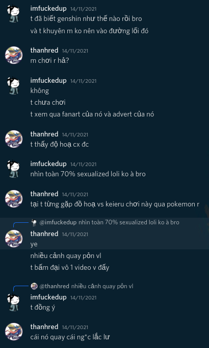

People in chat, imfuckedup is Thành's friend, thanhred is individual Thành, chat conversation is in Discord.
```
Translation:
Message #1 imfuckedup: I know that how is Genshin
Message #2 imfuckedup: and I suggest you not to get in that thing
Message #3 thanhred: You played it already? 
Message #4 imfuckedup: No
Message #5 imfuckedup: I haven't played it yet
Message #6 imfuckedup: I have seen its fanart and advertisements
Message #7 thanhred: I think Genshin's graphics is good
Message #8 imfuckedup: Seeing it 70% of them are sexualized lolis
Message #9 thanhred: Because I already met the graphics and played Keieru played this with pokemon
Message #10 thanhred: [Reply to Message #7] ye
Message #11 thanhred: A lot of porn videos
Message #12 thanhred: I clicked on a random video and see like that
Message #12 imfuckedup: [Reply to Message #11] I agree
Message #13 thanhred: And it is recording boobs bouncing.
```

After a while since this happened, he reported that he is playing Genshin Impact, talking about in-game stuff, etc. When *imfuckedup* mentioned about it, thanhred replied that

"I play it because I like it"

Assumed harem members also tried to stop *imfuckedup* from mentioning about this.

This concludes why Genshin partially proves the Thành's harem criticism.

### Indication #4
<hr>
On December 6th 2021, a Discord server named `DaDog v2` has Thành currently moderator in there. Assumed harem member named Linh joined the server as a member, by default a member should go to a text channel named `#apply-for-mod` but this member named Linh didn't do instructions in `#apply-for-mod` but still get mod. After an investigation how, `imfuckedup` checked `Audit log`, a useful place for moderators. Seeing this:

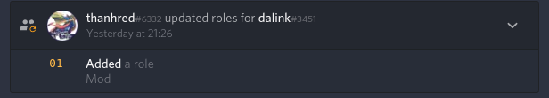

This means that Thành has manually added `mod` role for Linh, which is assumed harem members. However, he said that he accidentally pressed random buttons as explained in this snippet of chat.

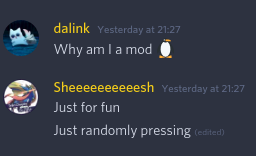

This should be normal but, after finding out he randomly pressed the buttons and know Linh is a mod, he didn't remove the `mod` role for Linh if he finds it out as an accident, and already found the result of the accident.

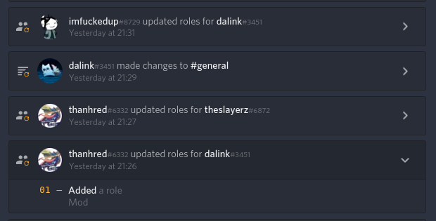

As seen in the image, we can see that it already 5 minutes that since the message of *realization* that Linh is accidentally added as a mod. `imfuckedup` just went back to check messages in there and then removed the `mod` role for Linh.

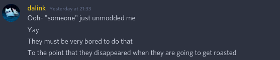

After removing the `mod` role for Linh about 2 minutes, Linh started to mock `imfuckedup` after removing *her* `mod` role. And want to start to try to roast `imfuckedup`. The thread after is a whole mess so it won't be discussed.

However, these messages are defending for Thành, which means Linh and Thành simps for each other. Another assumed harem member named Nghi also talked in the thread roasting `imfuckedup`, without finding the main cause which means just defending for Thành.

This concludes that these 2 assumed harem members tried to defend Thành a lot.

### Indication #5
<hr>
On December 6th 2021, individual named Văn Quyết attempted to reach Thành talking about his Genshin experience. Văn Quyết sent the following image as a joke to Thành through Zalo platform.

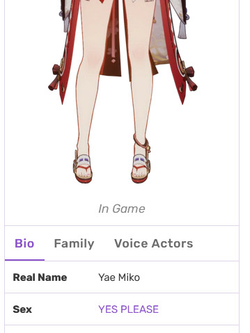

The text `Sex`: `YES PLEASE` is acted as joke wanting sex with an in-game character named `Yae Miko` as seen in the image.

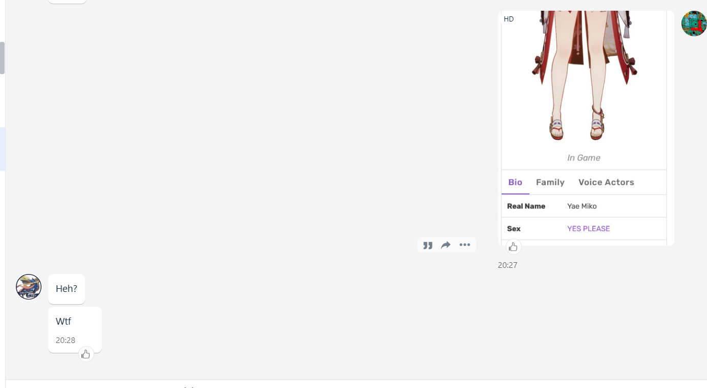

Thành replied as a reaction to this, in fact, he already thought that this is a joke, so there is nothing much suspicous to see here. Also, `heh` is acting like he knows nothing but in fact, he does.

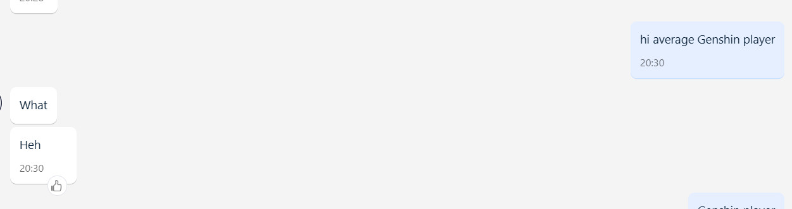

Văn Quyết sent a message containing `hi average Genshin player`, indicating that `Hello Genshin Impact player`, meaning that he is doing a little mocking towards Genshin Impact players. Again, Thành acted `heh`, indicating like he knows nothing but in fact he knows that Văn Quyết is mocking him.

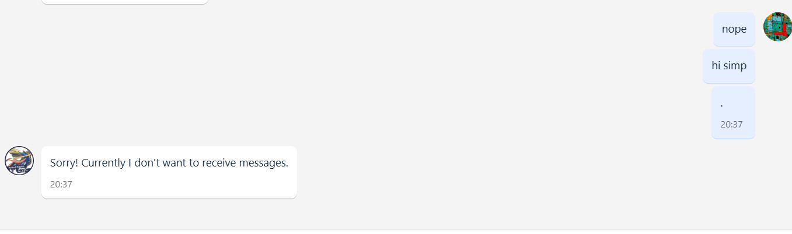

This time, Văn Quyết sent `hi simp`, indicating that he assumes that Thành has a harem after he read some information about this, meaning that Thành is simping for his harem group. Now after Thành seen but didn't reply to the message. Văn Quyết tried to message `.` in order to check if he blocked or not. And yes, Thành blocked Quyết. 

<h5>Wait, but what does this mean if Quyết is blocked?</h5>

Quyết is blocked because of Thành is angry about the `simp`, he knows that he is simping for the harem group and play Genshin because of it, he gets angry so Quyết is blocked from Thành.


## Small indications
These will contain indications that it is too small to talk about, but it is better to list it out.


